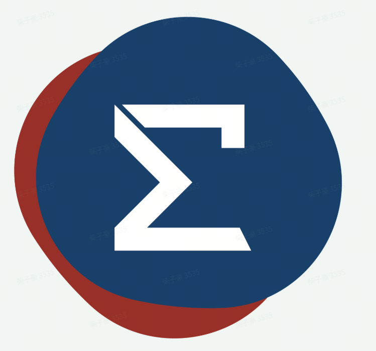

# smrcore_ros2

**ROS 2 integration for Smartmore robots.**

**English** · [简体中文](README.zh.md)

---

The public ROS 2 integration repository for **Smartmore robots**. It provides
robot descriptions, a `ros2_control` hardware plugin, MoveIt configuration,
Gazebo and MuJoCo simulation, SDK action/service wrappers, and ROS user-side
examples.

This is a public wrapper repository and does not include SDK headers or
libraries. Before building, `scripts/download.sh` downloads the released C++
SDK to `3rdparty/smrcore_sdk`. The ROS 2 packages locate
`smrcore_sdkConfig.cmake` and `smrcore::sdk` through `CMAKE_PREFIX_PATH`.

## Documentation

Installation, startup, control flows, and examples are documented in Chinese:

- [Quick start](docs/getting-started.md): prerequisites, SDK download, build,
  and startup options.
- [Architecture](docs/architecture.md): repository layers, control flows, and
  module responsibilities.
- [ros2_control](docs/ros2-control.md): physical-robot control flow, launch
  arguments, and `FollowJointTrajectory` usage.
- [SDK server](docs/sdk-server.md): SDK action, service, and topic interfaces.
- [RViz visualization](docs/rviz.md): robot model viewing, mock backend, and
  RViz startup.
- [MoveIt integration](docs/moveit.md): MoveIt demo, physical-robot execution
  flow, and C++ examples.
- [Gazebo simulation](docs/gazebo.md): Gazebo backend, Chinese-path handling,
  and simulation verification.
- [MuJoCo simulation](docs/mujoco.md): simulator download and ROS 2 startup
  using the same flow as a physical robot.
- [Example index](examples/README.md): `smrcore_examples` entry points and
  links to their module documentation.

## Modules

| Module | Responsibility |
|---|---|
| `ros2/smrcore_msgs` | ROS 2 action, service, and message interfaces |
| `ros2/smrcore_description` | SMR-i3 xacro, meshes, RViz configuration, and joint naming |
| `ros2/smrcore_hardware` | `ros2_control` hardware plugin based on `rcore::sdk::Robot` |
| `ros2/smrcore_bringup` | Controller-manager startup for physical or mock backends |
| `ros2/smrcore_sdk_server` | SDK task-motion and state capabilities as ROS 2 actions, services, and topics |
| `ros2/smrcore_moveit_config` | MoveIt planning groups, controllers, and RViz configuration |
| `ros2/smrcore_gazebo` | Gazebo Classic startup and model-asset preparation |
| `ros2/smrcore_examples` | User-facing control, state, and MoveIt examples |

## Control Interfaces

This repository provides two interfaces that connect to a robot and can command
motion:

- `ros2_control`: the recommended standard ROS real-time trajectory control
  interface, using `joint_trajectory_controller` and
  `FollowJointTrajectory`.
- SDK server: intended for SDK task motion and discrete operations. It provides
  actions for MoveJ, MoveP, MoveL, MoveC, and MovePath, plus services and
  topics for recovery, error clearing, IK/FK, and state queries.

When controlling a physical robot, choose the appropriate interface for the
task. Do not start both motion backends to control the same robot by default.

## Safety

> Robots are hazardous machines. Before running any motion example, verify the
> target is safe for the current robot, tool, payload, and workspace. Confirm
> the emergency stop is reachable and the workspace is clear.

## License

This repository is released under the [Apache License 2.0](LICENSE). Third-party
components included in prebuilt SDK release artifacts carry their license and
attribution notices in the corresponding release archive.
