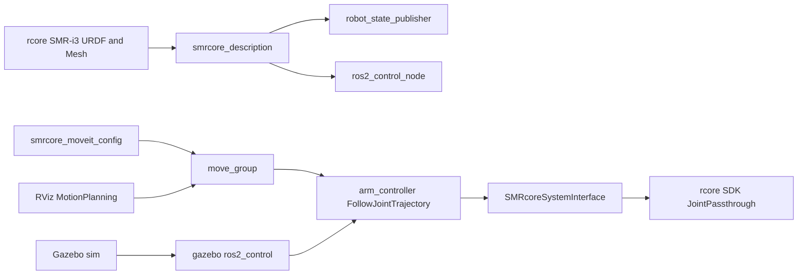

# smrcore_ros2 完整 ROS 2 体验补齐计划

本文记录 `smrcore_ros2` 对照 `rokae_ros2` 后的补齐计划，目标是补完整
MoveIt 实时控制示例、RViz 可视化、Gazebo 仿真，以及真实 SMR-i3 描述资源接入。

## 当前对照结论

- `smrcore_ros2` 已有核心闭环：`ros2/smrcore_hardware/src/smrcore_system_interface.cpp`
  已实现 `hardware_interface::SystemInterface`，`write()` 调用
  `Robot::JointPassthrough(q, qd)`。
- `ros2/smrcore_bringup/launch/robot.launch.py` 已启动 `ros2_control_node`、
  `robot_state_publisher` 和 `arm_controller`。
- `ros2/smrcore_examples/src/follow_joint_trajectory.cpp` 已有标准
  `FollowJointTrajectory` 示例。
- 缺口集中在 ROS 生态层：没有 `smrcore_moveit_config` 包、没有可直接启动的
  RViz 配置、没有 Gazebo 仿真包/世界/仿真控制启动，也没有把 `rcore`
  中真实 SMR-i3 URDF 与 STL mesh 迁入 `smrcore_description`。
- `rokae_ros2` 可借鉴的是包形态和配置集合，例如 `*_moveit_config` 的
  `config/*.yaml`、`*.srdf`、`launch/demo.launch.py`、`move_group.launch.py`、
  `moveit_rviz.launch.py`，以及独立 Gazebo 包结构。
- 不照搬 `rokae_ros2` 的 position-only controller 配置；`smrcore_ros2`
  真机后端要求 `position + velocity` command，并通过
  `JointPassthrough(q, qd)` 透传。

## 推荐路线

采用“一次性补齐，但分层验证”的路线：

1. 迁入真实描述资源并跑通 `robot_state_publisher` / RViz。
2. 增加 MoveIt 配置和实时控制示例。
3. 增加 Gazebo 仿真包。

这样最终功能完整，但每一步都有独立可验证产物，出问题时能快速定位在描述、
MoveIt 配置还是仿真插件层。

备选路线是先只做 MoveIt/RViz，Gazebo 后置，风险更低但不满足完整目标；另一种
是完全从 MoveIt Setup Assistant 生成后再改，速度快但会引入大量模板文件和未审视
配置，不适合当前已有明确 `ros2_control` 接口语义的仓库。

## 设计与数据流

## 实施步骤

1. 描述资源补齐
   - 从 `rcore/data/model/SMR-i3-URDF-000_V260401` 迁入真实
     `SMR-i3-URDF-000.urdf`、`robot.xml` 和 `meshes/*.STL` 到
     `ros2/smrcore_description`。
   - 将 mesh 路径改为 ROS package URI。
   - 保留或替换当前简化 `smri3.urdf.xacro`，新增 `smri3_real.urdf.xacro`
     作为默认可视化和 MoveIt 源。

2. `ros2_control` 描述适配
   - 让真实 URDF 通过 xacro include 复用 `smri3.ros2_control.xacro`。
   - 统一关节命名。优先使用 rcore 模型真实关节名：
     `base_joint`、`shoulder_joint`、`elbow_joint`、`wrist1_joint`、
     `wrist2_joint`、`wrist3_joint`。
   - 同步更新 `smri3_controllers.yaml`、示例默认 joint names 和文档。
   - 若 SDK 状态数组本身不关心名称，只需保证 ROS 控制器和 MoveIt 一致。

3. RViz 可视化
   - 在 `smrcore_description/rviz` 或 `smrcore_bringup/rviz` 增加默认配置。
   - 更新 `robot.launch.py`，让 `use_rviz:=true` 自动启动 RViz。
   - 提供 `view_robot.launch.py`，只启动
     `robot_state_publisher + joint_state_publisher_gui + rviz2`，用于无机器人时检查模型。

4. MoveIt 配置包
   - 新增 `ros2/smrcore_moveit_config`。
   - 包含 `config/smri3.srdf`、`kinematics.yaml`、`joint_limits.yaml`、
     `ompl_planning.yaml`、`moveit_controllers.yaml`、`moveit.rviz`。
   - 包含 `launch/demo.launch.py`、`move_group.launch.py`、
     `moveit_rviz.launch.py`、`rsp.launch.py`、`spawn_controllers.launch.py`。
   - MoveIt controller 指向现有 `/arm_controller/follow_joint_trajectory`。
   - 保留 `position + velocity` 的 `ros2_control` controller 配置。

5. MoveIt 实时控制 example
   - 在 `ros2/smrcore_examples` 新增一个 MoveIt C++ 示例节点或 Python launch 示例。
   - 使用 `move_group_interface` 规划并执行到安全关节目标。
   - 示例文档明确它最终走
     `move_group -> arm_controller -> JointPassthrough`，不是 SDK MoveJ/MoveL action。
   - 现有 `ros2/smrcore_examples/launch/follow_joint_trajectory.launch.py`
     已覆盖标准 `FollowJointTrajectory` 基线，不重复新增同类示例；后续只把它作为
     MoveIt 接入前后的回归验证项。

6. Gazebo 仿真包
   - 新增 `ros2/smrcore_gazebo`。
   - 包含 `worlds/empty.world`、可选 `worlds/obstacles.world`、
     `launch/gazebo.launch.py` 或 `sim.launch.py`。
   - URDF/xacro 增加 Gazebo 所需惯量、材质、`ros2_control` 仿真插件分支。
   - 仿真后端使用 Gazebo 的 `ros2_control` 插件，不连接真实 SDK。
   - 增加 Gazebo example，用于启动空世界、加载 I3 机械臂模型，并通过
     `joint_trajectory_controller` 发送一段安全测试轨迹，确认模型、关节、controller
     和仿真后端能正常工作。
   - 通过 launch 参数选择 `hardware_backend:=real|gazebo|mock`，避免同一启动同时连接真机和仿真。
   - `mock` 指 ROS 2 的假硬件后端，通常使用 `mock_components/GenericSystem`，
     只在 ROS 2 内部回显 command/state，不连接真实 SDK，也不启动 Gazebo 物理仿真；
     它适合无机器人、无 Gazebo 时快速验证 MoveIt/RViz/controller 配置。

7. 文档与依赖
   - 更新 `README.zh.md`、`README.md`、`docs/getting-started.md`、
     `docs/ros2-control.md`。
   - 新增或扩展 `docs/moveit.md`、`docs/rviz.md`、`docs/gazebo.md`、
     `examples/README.md`。
   - 补齐 `package.xml` 依赖，例如 `moveit_ros_move_group`、
     `moveit_ros_planning_interface`、`moveit_configs_utils`、`rviz2`、
     `gazebo_ros`、`gazebo_ros2_control`。

8. 验证
   - 运行 `colcon build --base-paths ros2`。
   - 验证 xacro 展开。
   - 验证 RViz 可视化。
   - 验证 controller spawner，并回归现有
     `ros2/smrcore_examples/launch/follow_joint_trajectory.launch.py`。
   - 验证 MoveIt demo 启动和新增 MoveIt 完整示例执行。
   - 验证 Gazebo 空世界启动、I3 机械臂模型加载、Gazebo 示例轨迹执行。
   - 若环境缺 ROS/Gazebo 依赖，记录未能本机验证的命令和原因。

## 主要文件范围

- `ros2/smrcore_description`
- `ros2/smrcore_bringup`
- `ros2/smrcore_hardware/config/smri3_controllers.yaml`
- `ros2/smrcore_examples`
- 新增 `ros2/smrcore_moveit_config`
- 新增 `ros2/smrcore_gazebo`
- 文档入口：`README.zh.md`、`README.md`、`docs/*`、`examples/README.md`

## 风险控制

- 真机控制仍只通过 `JointPassthrough(q, qd)`，不引入 `ServoJ()` 回退。
- Gazebo 启动必须与真机 SDK 后端互斥，避免仿真和真实机器人共用同一个 controller
  launch 时误连真机。
- 真实 URDF 的 mesh 路径和 joint names 会影响 MoveIt、controller 和示例，需要一次性
  统一并用 xacro / `robot_state_publisher` 验证。
- `smrcore_sdk_server` 与 `ros2_control` 真机后端仍按二选一原则启动，避免双运动入口。
